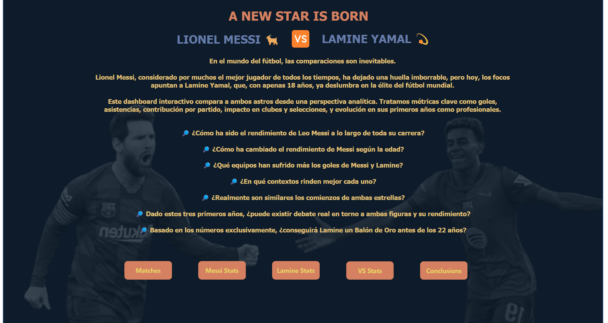
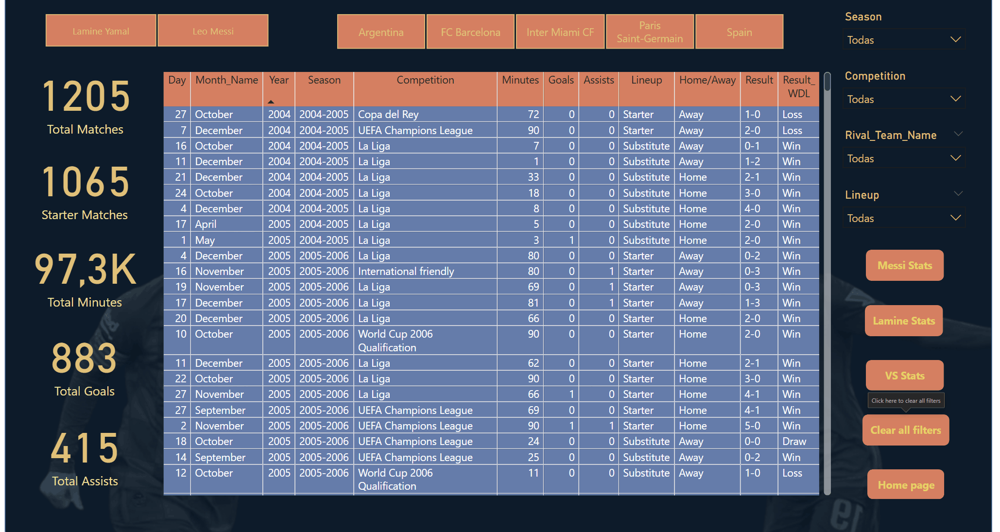
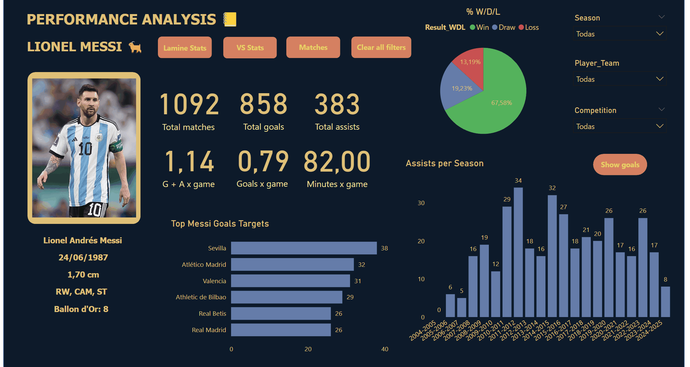
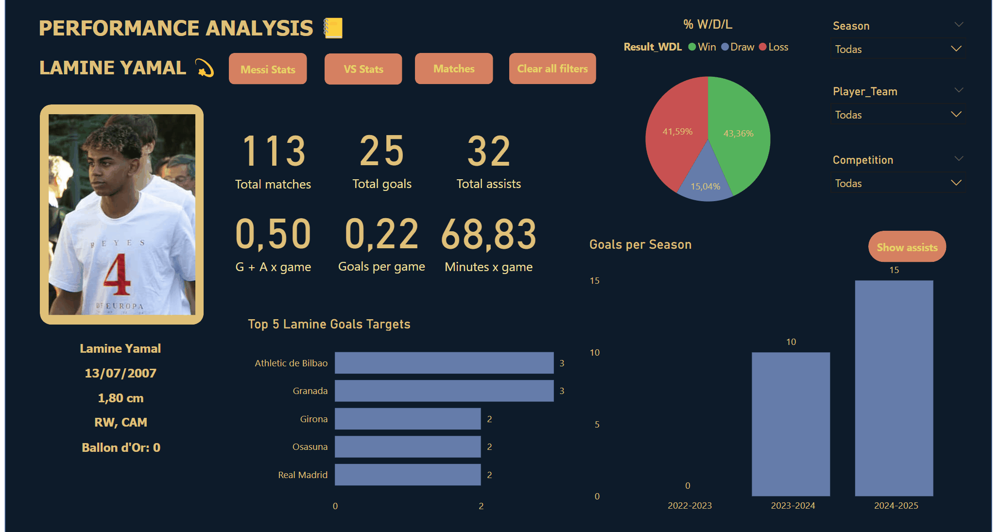
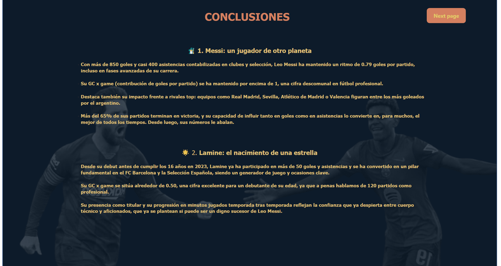

# ⚽ Proyecto: A NEW STAR IS BORN: Análisis completo y comparativo de las carreras de Messi y Lamine Yamal

En este proyecto encontraremos el proceso completo de ciencia de datos aplicado a un caso futbolístico real, con todos sus datos correspondientes y necesarios. A través del análisis comparativo de Lionel Messi y Lamine Yamal, buscamos responder preguntas clave sobre el rendimiento y la evolución de ambos, así como la proyección de Lamine, utilizando técnicas de scraping, procesamiento y limpieza, análisis estadístico, visualización y tests de hipótesis.

---

## 🌍 Contexto del Proyecto

Lionel Messi representa la la definición de la excelencia futbolística tras más de 20 años de carrera. Lamine Yamal es uno de los talentos más prometedores del fútbol mundial. Con este contraste entre leyenda y promesa conseguiremos explorar patrones y diferencias en los datos.

---

## 📁 Estructura del Proyecto

```
proyecto/
├── dashboard/                      # Dashboard Power BI (.pbix)
│   └── Players_career_data.pbix
├── designs/                        # Recursos visuales de portada
├── data/
│   ├── raw/                        # Datos crudos extraídos de la web
│   └── processed/                  # Datos limpios y transformados
├── gifs/                           # GIFs demostrativos (main.py, PowerBI)
├── images/                         # Visualizaciones guardadas como PNG
├── notebooks/
│   └── Tests.ipynb                 # Pruebas y exploraciones estadísticas
├── src/                            # Módulos fuente del proyecto
│   ├── scraping.py                 # Scraping de datos (Messi y Lamine)
│   ├── processing.py               # Limpieza, enriquecimiento, normalización
│   ├── analysis.py                 # Análisis exploratorio, visualizaciones
│   ├── db.py                       # Conexión con base de datos (opcional)
│   └── main.py                     # Ejecución completa del flujo ETL + análisis
├── requirements.txt
├── environment.yml
└── README.md                       # Documentación e instrucciones del proyecto
```

---

## 🔁 Flujo del Proyecto

### 1. Extracción (scraping.py)

- `scraping.py` automatiza la recolección de datos:
  - Messi: desde `messistats.com` (por temporada).
  - Lamine: desde `fbref.com` (por año).
- Guarda los CSV crudos en `data/raw/`.
- Créditos a ambas webs por facilitar estos maravillosos datos.

---

### 2. Procesamiento (processing.py)

- `processing.py` limpia y transforma los datos:
  - Homogeneiza competiciones, nombres de rivales, equipos.
  - Calcula edad, condición local/visitante, y rival real.
  - Añade columnas como `Season`, `Age`, `Player_Team`, `Rival_Team_Name`, etc.
- Exporta los resultados limpios a `data/processed/`.

---

### 3. Análisis Exploratorio y Estadístico (analysis.py)

- `analysis.py` genera insights y visualizaciones:
  - Goles/asistencias por temporada, año, mes, edad.
  - Comparación local vs visitante.
  - Distribuciones de minutos por edad.
  - Gráficas tipo KPI, barras, dispersión.

📊 Ejemplos visuales generados:
```
📌 ./images/goles_por_año.png
📌 ./images/lamine_goles_asistencias_por_edad.png
📌 ./images/local_vs_visitante.png
```

---

### 4. Dashboard en Power BI

- Power BI centraliza el análisis visual y storytelling del proyecto.
- Interactividad total: serás capaz de filtrar por jugador, equipo, competición, si fue titular o suplente, etc.
- Análisis visual de evolución por temporada, resultado, rival.

🎥 
🎥 
🎥 
🎥 
🎥 

---

### 5. Contrastes de Hipótesis

En `Tests.ipynb`, se aplicaron contrastes de hipótesis para comparar a ambos jugadores hasta los 18 años.

**Ejemplos:**
- ¿Quién contribuye más en goles + asistencias por minuto?
- ¿Quién ha jugado más minutos por partido?
- ¿Quién ha dado más asistencias por partido?

Cada prueba incluye:
- Estadístico t
- p-value
- Interpretación clara (significativa o no)

---

## 🚀 Ejecución

```bash
# 1. Clona el repo
git clone https://github.com/JuanmaCM7/Players_career_stats.git
cd Players_career_stats

# 2. Instala dependencias
pip install -r requirements.txt
# o con conda
conda env create -f environment.yml

# 3. Ejecuta el flujo completo, generando los csvs, imágenes en png y abriendo PowerBI
python src/main.py
```

🎥 

---

## 🧠 ¿Qué preguntas podrás responder gracias a este proyecto?

- ¿Quién ha tenido mayor impacto antes de los 18 años?
- ¿Cómo han evolucionado en minutos, goles y asistencias?
- ¿Qué diferencias hay entre jugar en club y selección?
- ¿En qué contextos (edad, competición, rival) se desempeñan mejor?

---

## 🧩 Herramientas Usadas

- Python (Pandas, Matplotlib, Plotly, Statsmodels, Scikit-learn)
- BeautifulSoup & Requests (Scraping)
- Power BI (Visualización interactiva)
- Jupyter Notebook (Experimentación)
- Git & GitHub

---

## 👨‍💻 Autor

- **Juan Manuel Cano Mayor**
- **Email:** juacanom@gmail.com
- **Curso:** Data Science & AI - Evolve Academy (Abril 2025)

---

## 📬 Notas Finales

Este proyecto está diseñado para que, en un futuro, pueda ser reproducible y adaptable a otras disciplinas. Se buscó demostrar cómo los datos pueden contar historias más allá de los goles: hablan de confianza, talento, rendimiento inmediato, y sobre todo, del potencial con el que cuenta Lamine Yamal y la increíble e inmaculada carrera de Lionel Messi.

🥳 Hasta aquí este proyecto. Muchas gracias por leerme y espero que puedas disfrutar de la historia que tre he contado.


